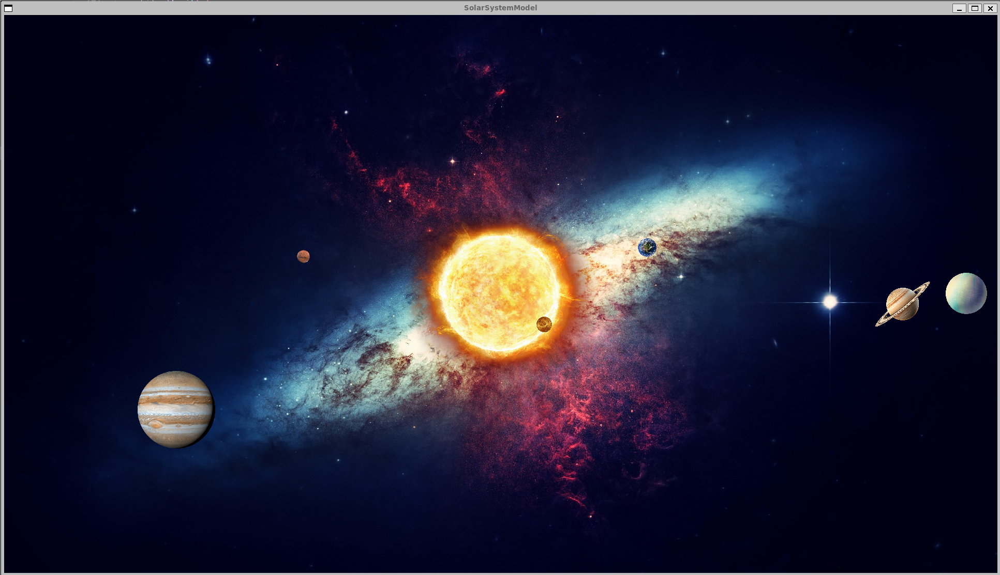
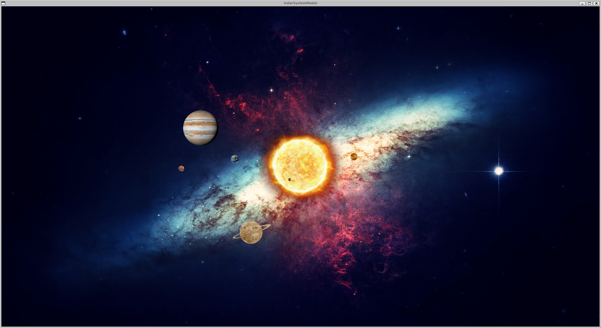
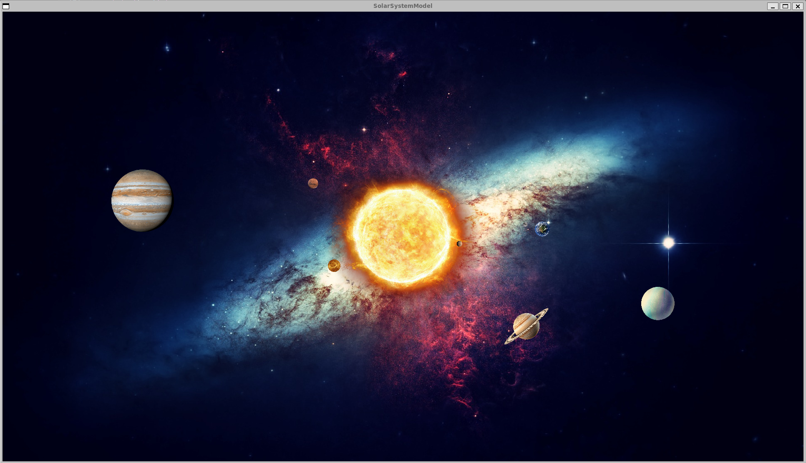

# SolarSystemModel
A simple solar system planetary motion model based on C++

# Build
## Ubuntu22.04
~~~sh
sudo apt install libsdl2-dev libsdl2-image-dev libsdl2-mixer-dev
mkdir build
cd build
cmake ..
make
~~~
# Image

